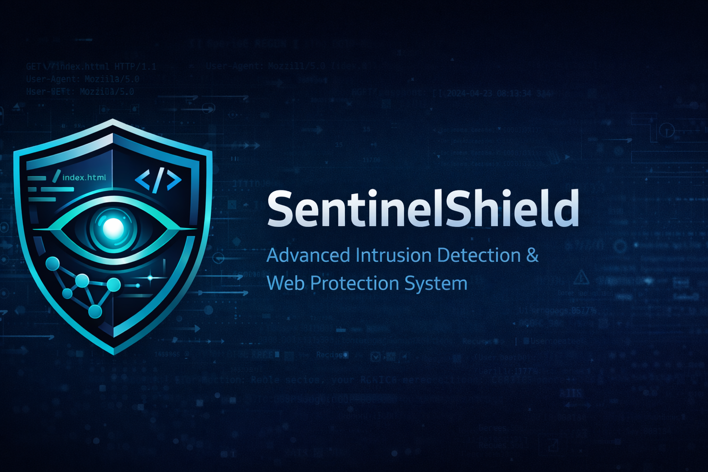
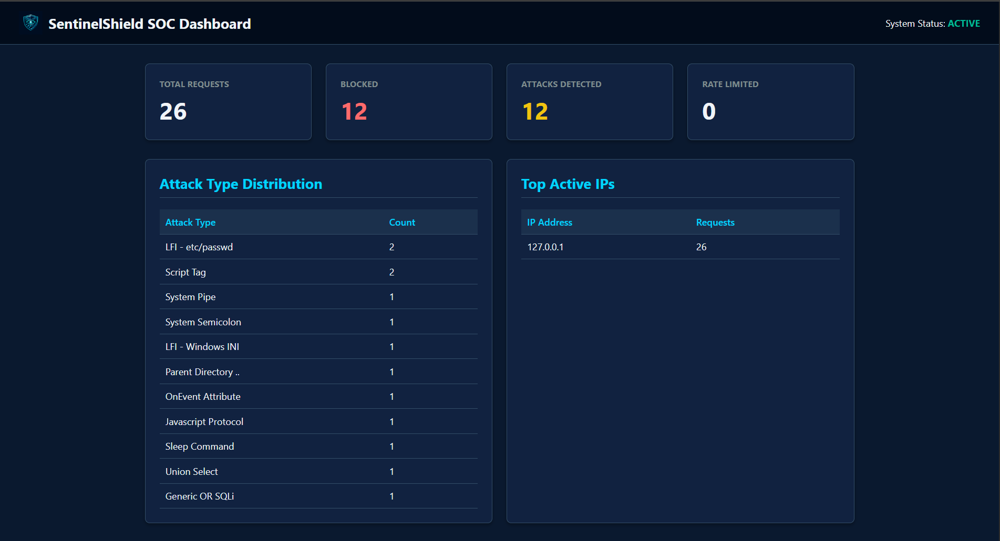
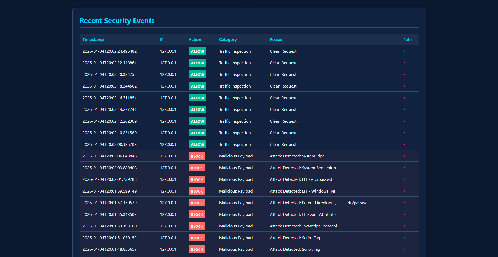
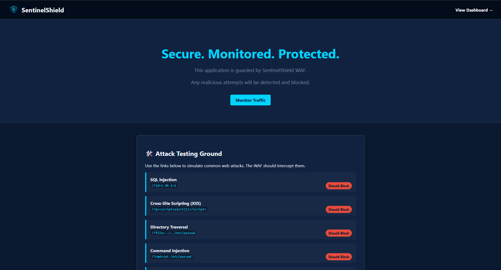
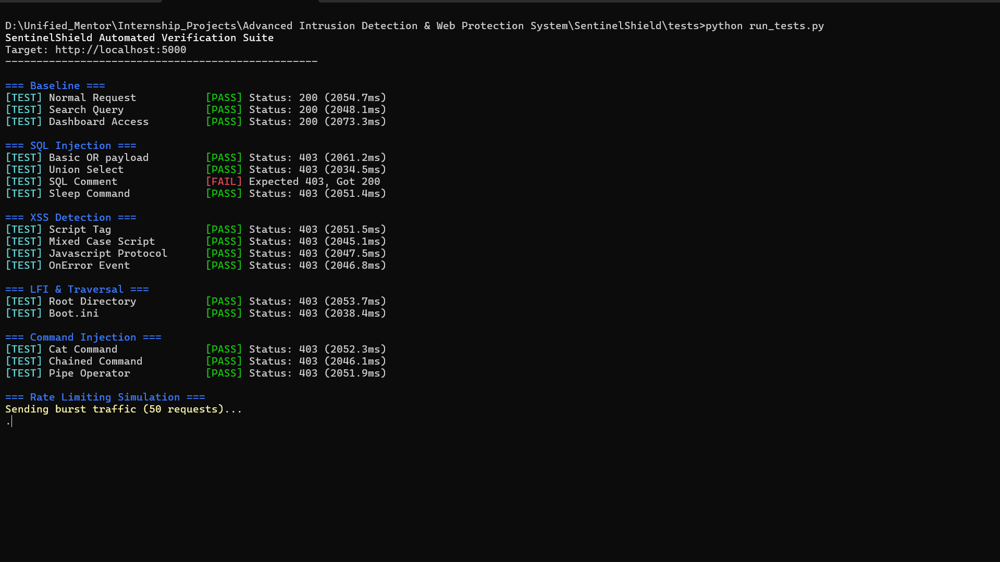
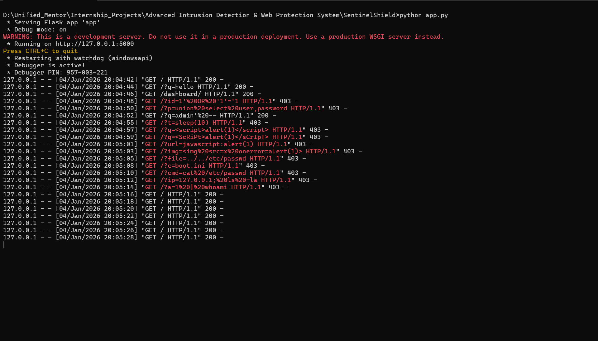

# SentinelShield: Advanced Intrusion Detection & Web Protection System



SentinelShield is a lightweight, educational Intrusion Detection and Web Protection System designed to simulate the core behavior of a modern Web Application Firewall (WAF). It inspects incoming HTTP requests, detects malicious patterns (like SQLi, XSS, and LFI), blocks attacks, and visualizes security events in real-time.

---

## 📸 System Overview

### SOC Dashboard
Real-time view of traffic statistics, attack distribution, and recent security logs.


### Security Logs
Detailed inspection logs showing blocked attacks and allow-listed traffic.


### Protected Application
A modern, dark-themed landing page protected by the WAF.


### Verification
Automated test suite verifying detection capabilities.


### Runtime Inspection
Live terminal output showing request processing.


---

## ✨ Features

- **🛡️ HTTP Request Inspection**: Deep analysis of paths, usage arguments, headers, and payloads.
- **🚫 Attack Detection**: Signature-based detection for:
  - **SQL Injection (SQLi)**
  - **Cross-Site Scripting (XSS)**
  - **Local File Inclusion (LFI)**
  - **Directory Traversal**
  - **Command Injection**
- **⚡ Rate Limiting**: Behavior monitoring to block abusive IPs (flooding/brute-force).
- **📊 SOC Dashboard**: Interactive web interface to monitor threats.
- **🎨 Modern UI**: Professional Dark theme with responsive design.

---

## 🚀 Quick Start

### Prerequisites
- Python 3.x
- Flask

### Installation

1. **Clone the Repository**
   ```bash
   git clone https://github.com/Butler1993/SentinelShield-main.git
   cd SentinelShield
   ```

2. **Install Dependencies**
   ```bash
   pip install -r requirements.txt
   ```

### Running the System

1. **Start the Application**
   ```bash
   python app.py
   ```
   The application will start on `http://localhost:5000`.

2. **Access the Dashboard**
   Navigate to `http://localhost:5000/dashboard` to view the security overview.

3. **Simulate Attacks**
   Use the buttons on the home page or `curl` to test the WAF:
   ```bash
   # SQL Injection Test
   curl "http://localhost:5000/?id=1' OR '1'='1"

   # XSS Test
   curl "http://localhost:5000/?q=<script>alert(1)</script>"
   ```

4. **Run Verification Suite**
   ```bash
   python tests/run_tests.py
   ```

---

## 📂 Project Structure

```
SentinelShield/
├── app.py                  # Main Flask Application
├── config.py               # Configuration settings
├── core/                   # Security Engine Core
│   ├── request_parser.py   # HTTP Request Normalizer
│   ├── signature_engine.py # Regex Attack Detection
│   ├── behavior_monitor.py # Rate Limiting Logic
│   └── decision_engine.py  # ALLOW/BLOCK Logic
├── dashboard/              # Dashboard Blueprint
├── logs/                   # Security Event Logs
├── rules/                  # Attack Signatures
├── static/                 # CSS, Images, Assets
├── templates/              # HTML Templates
└── tests/                  # Automated Test Scripts
```

---

## 🛡️ Detection Logic

SentinelShield uses a multi-layered approach:

1. **Request Parsing**: Incoming HTTP requests are broken down into components (Path, Query, Headers, Body).
2. **Behavior Analysis**: The IP address is checked against rate limits (e.g., max 100 requests/minute).
3. **Signature Matching**: The content is scanned against a database of regex patterns for known attacks.
4. **Decision Engine**: If any check fails, the request is **BLOCKED** (403 Forbidden); otherwise, it is **ALLOWED** (200 OK).

---

## 📝 License

This project is open-source and available under the [MIT License](LICENSE).
